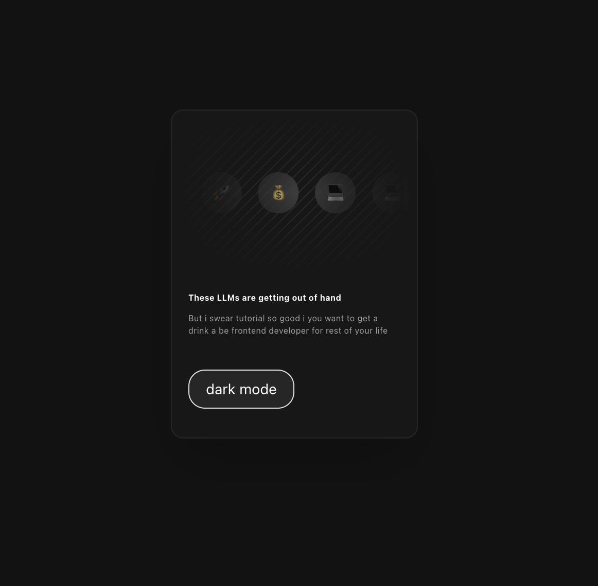

# Dark Mode

### Documentation
- [Tailwind CSS Dark Mode Docs](https://tailwindcss.com/docs/dark-mode)

## Tailwind CSS v4 Concepts

### `@theme` vs `@theme inline`

#### `@theme` Block
Defines theme-wide custom properties and utilities that can be used throughout your application.

**Example from `globals.css`:**
```css
@theme {
  --animate-marque: marque 10s linear infinite;
}
```

- Defines reusable theme values
- Creates utilities automatically (e.g., `animate-marque`)
- Can include keyframes, colors, spacing, etc.

#### `@theme inline`
Maps CSS custom properties to Tailwind's theme system for use with utility classes.

**Example from `globals.css`:**
```css
@theme inline {
  --color-background: var(--background);
  --color-foreground: var(--foreground);
}
```

- Maps existing CSS variables to Tailwind utilities
- Enables use of `bg-background`, `text-foreground`, etc.
- Bridges CSS variables with Tailwind's utility system

**Usage:**
- `@theme`: Define new theme values
- `@theme inline`: Map existing CSS variables to Tailwind

---

## Custom Variables & Arbitrary Values

### Defining Custom Variables
Custom or arbitrary values can be defined anywhere using the syntax:
```css
[--variable-value:10px]
```

### Important Rules
1. **No spaces in variable names**: Use underscores (`_`) instead of spaces
   - Correct: `[--pattern-fg:var(--color-neutral-950)]`
   - Wrong: `[--pattern fg:...]`

2. **Using Variables**: Access with `var(--variable-name)`
   ```css
   /* Define */
   [--pattern-fg:var(--color-neutral-950)]/5
   
   /* Use */
   bg-[repeating-linear-gradient(315deg,var(--pattern-fg)_0,...)]
   ```

---

## Animations & Keyframes

### Creating Custom Animations

#### Using `@theme` Block (Recommended)
```css
@theme {
  --animate-marque: marque 10s linear infinite;
  @keyframes marque {
    from {
      transform: translateX(-100%);
    }
    to {
      transform: translateX(100%);
    }
  }
}
```

**Usage:**
```tsx
<div className="animate-marque">...</div>
```

### Animation Properties
- **Keyframe name**: `marque`
- **Duration**: `10s`
- **Timing function**: `linear`
- **Iteration**: `infinite`

---

## Mask Utilities

### Mask Syntax
The `mask-*` utilities control which parts of an element are visible.

**Syntax:**
```
mask-{side}-from-{percentage}
```

**Sides:**
- `l` - left
- `r` - right
- `t` - top
- `b` - bottom

### Example
```tsx
<div className="mask-l-from-50% mask-r-from-50% mask-t-from-50% mask-b-from-50%">
  {/* Content with gradient mask from all sides */}
</div>
```

---

## ThemeProvider Setup

### Installation
```bash
npm i next-themes
```

### Configuration in `layout.tsx`

```tsx
import { ThemeProvider } from "next-themes";

export default function RootLayout({ children }) {
  return (
    <html lang="en">
      <body>
        <ThemeProvider 
          attribute="class"      // Adds/removes `dark` class on `<html>` element
          defaultTheme="system"  // Respects system preference
          enableSystem          // Enables system preference detection
        >
          {children}
        </ThemeProvider>
      </body>
    </html>
  );
}
```
### Custom Dark Mode Variant

In `globals.css`:
```css
@custom-variant dark (&:where(.dark, .dark *));
```

This creates a custom dark mode variant that:
- Targets elements with `.dark` class
- Also targets children of `.dark` elements
- Uses `:where()` for lower specificity

---

## CSS Variables for Theming

### Root Variables
```css
:root {
  --background: #ffffff;
  --foreground: #171717;
}

.dark {
  --background: var(--color-neutral-950);
  --foreground: #ffffff;
}
```

### Using with Tailwind
After mapping in `@theme inline`:
```tsx
<main className="bg-background text-foreground">
  {/* Uses --background and --foreground variables */}
</main>
```
---

